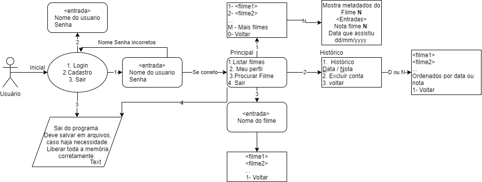

# UFLIX - Trabalho Prático de Tópicos Especiais em Programação I
**[Leonardo Franco Emerick Albergaria](https://github.com/LeoAlbergaria) e Rafael de O. Cozer**


DI/UFES

## 1. Objetivos

Este primeiro trabalho visa o desenvolvimento das habilidades de criação de tipos abstratos de dados, bibliotecas, organização e documentação correta de código, gerenciamento de memória e compilação automática de código.  Para isto, o objetivo deste trabalho é o desenvolvimento de um sistema de gerenciamento e visualização de filmes.  Considere um sistema de streaming simples de filmes no terminal, capaz de listar, adicionar, pesquisar filmes.   As funcionalidades e especificações do sistema (quanto a formato de arquivos, como compilar, etc.) seguem nesse arquivo, mas estão sujeitas a mudanças:

  ## 2. Descrição do sistema

O objetivo deste trabalho é simular um serviço de streaming de vídeos.  Para isto, o usuário do programa deve ter uma conta que contem login e senha.  Após o login, o programa cliente carregará um catálogo de filmes disponíveis e o usuário poderá selecionar um filme para "assistir". O catálogo de filmes deve ser armazenado em um arquivo com os metadados dos filmes, arquivo explicado posteriormente.

O usuário deve ser capaz de visualizar a lista de filmes disponíveis, as informações sobre os filmes (metadados), pesquisar por um filme e escolher um filme para assistir. Deve ser feito o tratamento da entrada do usuário, para caso o usuário digite alguma opção inválida o programa saiba lidar com isso.  Para cada filme "assistido", o usuário pode atribuir uma nota ao filme.  

Os filmes assistidos devem ser salvos em um histórico. O histórico contém a data que o filme foi assistido e a nota que o usuário deu para aquele filme. O usuário pode exibir o histórico ordenado por data ou por nota, de forma descendente, isto é, do mais recente/melhor avaliado para o mais antigo/pior avaliado.

### 2.1 Funcionalidades

  

O programa funcionará com uma interface do usuário com o sistema. Isso deve ser feito no terminal a partir da leitura de números que representam decisões do usuário. Considere que ao iniciar o programa o usuário pode indicar se ele quer que o menus sejam impressos ou não.

A Figura abaixo apresenta de forma sumarizada todas as funcionalidade que o sistema deve conter:



Ao executar o programa, deve ser carregado na memória a lista de filmes disponíveis e os usuários cadastrados. O Formato dos arquivos é discutido na próxima seção.

### 2.1.1 Menu Login

A  primeira "tela" que o usuário deve ver é uma tela de login com as opções:


    
    1- Login
    2- Cadastrar
    3- Sair

#### Opção 1 - Login

Quando o usuário entrar a opção 1, recebe 2 strings como entrada. Por exemplo:


    1
    joao
    123456

 O programa deve comparar o usuário e senha com os carregados pelo arquivo usuarios.csv. Três condições podem ocorrer:
  
  1. Se usuário existe e senha correta, vai para o menu principal.
  2. Se usuário não existe, exibe a mensagem abaixo e volta ao menu anterior.

    Usuario nao cadastado.    
  
  3. Se usuário existe e a senha está incorreta, exibe a mensagem abaixo e volta ao menu anterior.
    
    Senha incorreta.    


#### Opção 2 - Cadastrar usuário

 Permite cadastrar usuários. Para cada cadastro é necessário inserir nome e senha.  Como no exemplo:
 

    Usuário: <entrada>
    Senha: <entrada>
    Confirmar senha: <entrada>

**Regras para nome e senha de usuário**:
 -  Usuario e senha são strings alfanumericas de qualquer tamanho mas não contêm acentos e nem espaços.
 - O programa deve verificar que não existe usuário com mesmo nome já cadastrado.
 - Deve-se garantir que a confirmação da senha é igual a senha. 
 
Caso contrário, exibir as respectivas mensagens de erro e voltar ao menu anterior:
  
    Senha fora do padrao.
    Usuario ja cadastrado.
    Senha incorreta.    

#### Opção 3 - Sair

Sempre que o usuário sair do programa pelo menu, deve-se garantir que quaisquer dados que precisam ser persistidos já foram salvos em arquivos. Por exemplo, adicionou um novo usuário no arquivo de usuários  ou um filme ao histórico do usuário. 

Além disso, é dever do desenvolvedor  garantir que toda a memória foi liberada.  Vazamentos de memória serão penalizados.

### 2.1.2 Menu principal

Caso o login esteja correto, o programa vai para o Menu principal que contém as seguintes opções:

    1- Listar filmes
    2- Meu perfil
    3- Procurar Filme
    4- Sair

#### Opção 1 - Lista de filmes

Exibe a lista de filmes disponíveis, exibindo um identificador e o título do filme e aguarda uma entrada do usuário.


    1- <filme1>
    2- <filme2>
    ...
    <entrada esperada>
    id do filme que deseja assistir
    M - Mais filmes
    0- Voltar

Considerando que o número de filmes a serem exibidos pode ser grande demais, deverá ser definido um limite de títulos a  serem exibidos. 


Para exemplificar, suponha que a base contenha 100 filmes e o limite de exibição é de 10 filmes.  Serão listados os filmes de 1 a 10, se usuário entrar a opção *M*, são mostrados os filmes de 11 a 20 e por aí vai. Caso não tenha mais filmes a serem listados a opção M exibe a mensagem 

    Fim de filmes disponiveis


Se o usuário digitar um inteiro maior que zero, assume-se que trata-se de um  filme que se deseja assistir. 

Após o usuário digitar a entrada com o filme desejado, são exibidas Informações sobre o filme (exemplo do primeiro filme do arquivo de filmes  `filmes-grande.csv`):

    Titulo: Amazing Stories
    Ano: 1986
    Duração: 111 minutos
    Avaliação: 7.2
    Descrição: A compilation of episodes from the anthology SF/Fantasy TV series.

    1- Assistir
    2- Voltar 
    <entrada>

Ao assistir o filme, **opção 1**, é solicitado sua avaliação (float) e a data em que foi assistido (string no formato dd/mm/yyyy):

    O que achou de Amazing Stories? De uma nota entre 0 e 10:
    <entrada>
    Data: <entrada>

A opção voltar deve sempre retornar à tela anterior. Para ficar claro, observem a imagem do fluxo do programa para ter certeza de onde as opções devem levar.

#### Opção 2 - Meu perfil:

As seguintes opções são mostradas:

    D ou N- Histórico ordenado por data ou por Nota
    2. Excluir minha conta
    <entrada>
    3. Voltar

Caso o usuário entre com as opções *D* ou *N*, é apresentado o histórico de filmes que o usuário assistiu. Contendo data, título e avaliação dada para o filme. Sendo que a opção *D* apresenta o histórico ordenado por data do mais recente para o mais antigo  e a opção *N* apresenta o histórico ordenado por nota, da maior para a menor.

    Nome: joao
    Meu historico:
        28/03/2021 - Amazing stories: Sem avaliacao
        <data2> - <filme2>: <avaliacao2>
   

A opção 2 permite excluir a conta do usuário. A exclusão pode ser apenas marcando uma  conta como inativa. Neste caso, a conta não precisa ser excluída, mas apenas marcada como inativa, impedindo que alguém logue nela e permitindo que uma nova conta com mesmo usuário seja criada. A solução de apenas inativar a conta leva a modificações no login, que passa a ter que verificar se uma conta é ativa ou não.

#### Opção 3 - Procurar filme

Oferece a seguinte opção ao usuário:

    Nome do filme: <entrada>

A tela seguinte (que aparece após a submissão do nome o filme) deve conter todos os filmes que possuem a string que foi escrita dentro de seus nomes. Por exemplo, imagine que na base de dados tenham os filmes: Jogos Mortais 1, Jogos Mortais 2, O jogo da imitação, Jogando Xadrez com a Morte. Agora, na busca por um filme, submetemos a palavra "jogo". Os resultados da busca devem ser:

    1- Jogos Mortais 1
    2- Jogos Mortais 2
    3- O jogo da imitação

Perceba que aqui, "Jogando Xadrez com a Morte" não aparece pois o título não possui a string "jogo" dentro dela.

#### Opção 4 - Sair

Essa opção te leva de volta ao menu de login inicial. A partir daí você pode logar em outra conta, criar uma nova conta ou encerrar o programa.

### 2.2. Verbosidade (verbosity)

Verbosidade é quanto de saída um programa gera. Esse conceito é amplamente utilizado para se ter uma versão de depuração de programas e outra para produção.  

Neste trabalho, verbosidade vai indicar se os menus apresentados na seção anterior serão exibidos ou não. 

Considere que o seu programa vai receber como argumento um inteiro 0 ou 1 que indica a verbosidade, exemplo `./tp 1` ou `./tp 0`.

Caso o argumento seja 1, os menus são exibidos conforme descrito nas seções anteriores. Caso o argumento seja 0, o programa recebe as entradas do usuário e apenas imprime a saída final, se tiver. Por exemplo, dar nota a um filme sem exibir os menus:
```
<entrada>
./tp 0
1 
joao
123456
1
```
```
<saída>
<<Lista de filmes>>
```
```
<Continuação entrada>
1
```
```
<saída>
<<Metadado do filme 1>>
```

## 3. Arquivos de entrada

### 3.1. Arquivo usuarios.csv

Cada linha do arquivo foi atribuida à um usuário, tendo cada linha o ID do usuário, seu nome, senha e seu código de atividade (1 para ativo e 0 para inativo), nessa respectiva ordem, como no exemplo a seguir:

```cpp
4,vinicius,am8H3z2pL,1
5,saulo,naosabeaminhasenha,0
6,jessica,uflixtop,1
```
### 3.2. Arquivo historico.csv

Nesse arquivo, cada linha foi atribuída à um filme assistido, com seu respectivo id de usuário, título do filme, data em que foi assistido e nota, como no exemplo à seguir. 
PS.: Note que, o usuário 9 assistiu três filmes e, os três filmes, foram atribuídos à linhas diferentes. 

```cpp
8,Charlotte,12/12/1997,7.5
9,Love and Shukla,15/11/2012,5.5
9,Show Pieces,19/03/2001,5.6
9,Qian ren 3: Zai jian qian ren,12/04/2021,10.0
```

## 4. Compilação e execução

O arquivo `Makefile` compila e gera o executável `tp1`. Na compilação ele procura arquivos cabeçalhos na pasta `include`, códigos fonte em `src` e o arquivo que contém a função main em `client`. 


Ao executar `make`, modifique a variável `CLI` para mudar o arquivo cliente. Por exemplo,

    make CLI=client/main2.c

utilizaria a função main do arquivo `client/main2.c`. Por padrão, o makefile usa o arquivo `client/main.c`.

Para rodar o trabalho, execute o comando

    ./tp1